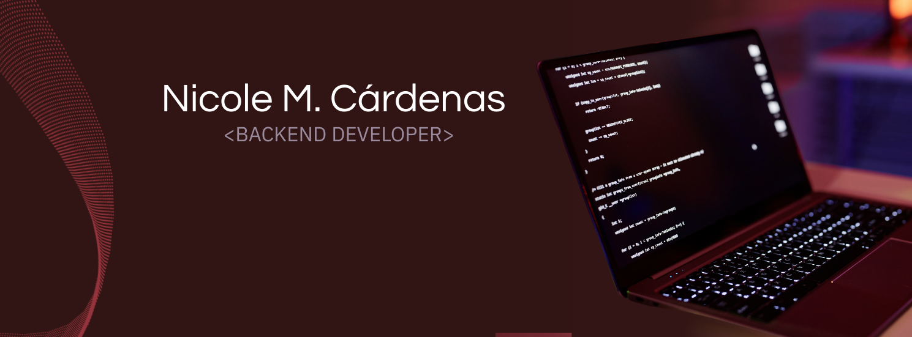

<!-- Imagen de portada -->

  

# 👋 ¡Hola! Soy Nicole  

### 🚀 Backend Developer | Fullstack Enthusiast  

  

Soy **Backend Developer** con experiencia fullstack 💻.  
Me apasiona construir **APIs REST, microservicios y aplicaciones escalables** usando **Node.js, NestJS, Express, TypeScript y PostgreSQL**, documentados con **Swagger**.  
También disfruto aportar en el lado frontend con **React, Next.js, HTML y CSS**.  

🌱 Mi objetivo es seguir creciendo en el mundo tech con proyectos innovadores.  
🎶 En mi tiempo libre disfruto la música, viajar y explorar nuevas experiencias.  

---

## 🛠️ Tech Stack

  
  
  
  
  
  
  
  

---

## 📌 Proyectos Destacados

### 🔹 [TrainUp](https://github.com/NicoleMCardenas/TrainUpBack)
Deploy: https://front-amber-tau.vercel.app/
Plataforma fitness & wellness que conecta gimnasios, entrenadores y miembros.  
Permite **gestionar suscripciones, clases, pagos y recordatorios automáticos**.  
- Roles de usuario: miembro, entrenador, admin.  
- Pagos integrados (MercadoPago).  
- Emails automáticos de bienvenida, pagos y recordatorios.  
- Backend: NestJS + PostgreSQL + TypeORM.  

---

### 🔹 [E-commerce](https://github.com/NicoleMCardenas/e-commerce)
Tienda online fullstack que gestiona productos, carrito y pagos.  
- Catálogo de productos y filtrado por categorías.  
- Carrito dinámico con checkout seguro.  
- Backend: Node.js + Express + PostgreSQL.  
- Frontend: React.  

---

### 🔹 [MadreAroma-FullStack (Reservas de Usuarios y Registros)](#)
Aplicación integral para gestión de proyectos.  
- Creación y administración de proyectos y tareas.  
- Asignación de usuarios y roles.  
- Dashboard visual para seguimiento.  

---

## 📬 Contacto

📍 México  
📧 **nicmocard@gmail.com**  
🌐 [LinkedIn](www.linkedin.com/in/nicolemorcar)  
💻 [GitHub](https://github.com/NicoleMCardenas)  

---

  ✨ _Estoy expectante a colaborar en proyectos backend y fullstack. ¡Hablemos!_ ✨

